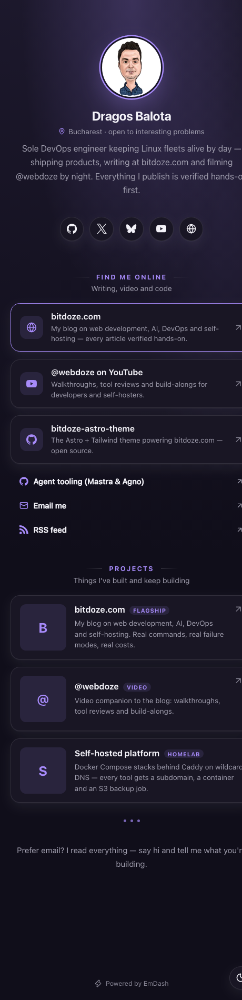

# Biolink — a link-in-bio theme for EmDash

A blocks-based link-in-bio theme for [EmDash](https://emdashhq.com/), the CMS built on Astro — running on **Cloudflare Workers** with D1 and R2. Give creators a page they fully control: profile, social links, custom links, projects, embeds — all edited as reorderable blocks in the admin UI, with per-page theming.

<p align="center">
	
	&nbsp;&nbsp;
	
</p>

[](https://deploy.workers.cloudflare.com/?url=https://github.com/bitdoze/emdash-biolink-theme)

- **Stack:** Astro 7 + [EmDash CMS](https://emdashhq.com/) on Cloudflare Workers (D1 database, R2 media storage)
- **Rendering:** server-side (`output: "server"`), no client JS except a tiny theme toggle
- **Icons:** [astro-icon](https://github.com/natemoo-re/astro-icon) with Simple Icons + Lucide — pick icons from a dropdown, no SVG hunting
- **Plugins:** none — every field is a built-in EmDash field type

## Features

- **Profile header** — avatar, name, bio, location/handle line
- **Social icons row** — 30+ networks (GitHub, X, Instagram, YouTube, TikTok, LinkedIn, Bluesky, Mastodon, Discord, Twitch, Telegram, WhatsApp, Reddit, Spotify, Substack, Patreon, Ko-fi, Dribbble, Behance, CodePen, RSS…) plus generic website/email/phone/link icons
- **Block editor** — add, reorder, duplicate and delete blocks per page:
  | Block | What it does |
  |---|---|
  | Social Icons | Row of icon buttons linking to profiles |
  | Link | Full-width link card with optional description, icon or thumbnail, featured style |
  | Link List | Compact group of smaller links |
  | Heading | Section title + optional subtitle |
  | Project | Card with image, title, description and tag |
  | Text | Free-form rich text |
  | Image | Image with optional caption and link |
  | Embed | YouTube, Vimeo, Spotify, SoundCloud (graceful link fallback for anything else) |
  | Divider | Line, dots or space |
- **Appearance controls** per bio page, all in the admin:
  - Theme mode: system / light / dark (with a visitor-facing toggle in system mode)
  - 10 color schemes: violet, ocean, sunset, forest, rose, amber, candy, cyber, mono, slate
  - Hex overrides for accent, background, text and card colors — light/dark counterparts are derived automatically
  - Background: gradient, solid color, or image upload
  - Card style: soft, outline, solid, glass
  - Corner radius: rounded, pill, sharp
  - Avatar shape, font stack, optional "Powered by EmDash" footer
- **Multiple pages** — the `home` profile renders at `/`, every other Bio Page renders at `/:slug`

## Getting started

Scaffold a new site from the theme with `npm create astro`:

```bash
npm create astro@latest -- my-links --template github:bitdoze/emdash-biolink-theme --no-ai
cd my-links
npm install
npm run dev
```

(`--no-ai` keeps the theme's own `AGENTS.md` — otherwise create-astro replaces it with generic Astro docs. Plain `git clone` works too: clone, `npm install`, `npm run dev`.)

Then open the admin and complete the setup wizard:

- **Site:** http://localhost:4321
- **Admin:** http://localhost:4321/_emdash/admin

Local development uses workerd, so D1 and R2 are emulated on your machine — no Cloudflare account needed until you deploy. The wizard runs migrations and applies `seed/seed.json`, which creates the **Bio Pages** collection, all block types, and a demo profile you can edit or replace. The demo avatar is downloaded from a remote URL during seeding.

## Editing your page

In the admin, open **Bio Pages → home**. The entry has three groups:

1. **Profile** — name, bio, profile picture, location/handle
2. **Appearance** — theme mode, color scheme, color overrides, background style/image, card style, corner radius, avatar shape, font, footer branding
3. **Blocks** — the page layout. Use **Add block**, drag to reorder, duplicate or delete

Publish and the page is live at `/` (or `/:slug` for additional pages).

### Social icons

The **Social Icons** block is a list of `network` + `url` pairs. The network dropdown is the icon picker — each option maps to a Simple Icons or Lucide icon. The mapping lives in `src/icons.ts`; the icon allowlist lives in `astro.config.mjs` (`icon({ include: … })`). Add a new network by extending both plus the field's `options` in `seed/seed.json`.

### Colors without a color picker

EmDash core has no color field, so the theme offers both presets and free-form overrides:

- **Color scheme** — pick a palette; it defines accent, background, card and text for both light and dark
- **Accent / Background / Text / Card color** — paste any hex value (`#ff5722`) to override the preset. A matching counterpart for the opposite scheme is derived automatically, and button text contrast is computed for readability

### Multiple pages

Create more Bio Pages in the admin to publish additional link pages — each keeps its own blocks and theme. A page with slug `links` renders at `/links`. `home` always renders at `/` and `/home` redirects there.

## Deploying

The fastest path is the **Deploy to Cloudflare** button at the top — Workers Builds clones the repo, builds it, and provisions the D1 database and R2 bucket from `wrangler.jsonc` automatically.

From the CLI instead:

```bash
npx wrangler login
npm run deploy          # astro build && wrangler deploy
```

Before deploying, edit `wrangler.jsonc` to rename the worker, D1 database (`emdash-biolink`) and R2 bucket (`emdash-biolink-media`) to your liking. The first deployment provisions both. See [Deploy to Cloudflare](https://docs.emdashcms.com/deployment/cloudflare/) in the EmDash docs for production details (custom domains, migrations, media delivery).

Prefer a Node.js server instead? The theme's pages and components are runtime-agnostic — swap `astro.config.mjs` to `@astrojs/node` + `sqlite()`/`local()` drivers (see [Deploy to Node.js](https://docs.emdashcms.com/deployment/nodejs/)) and `wrangler.jsonc`/`src/worker.ts` can be deleted.

## Commands

```bash
npm run dev          # dev server (workerd, with local D1/R2)
npm run build        # production build → dist/
npm run preview      # preview the built worker locally
npm run deploy       # astro build && wrangler deploy
npm run typecheck    # astro check
npx wrangler types   # regenerate worker-configuration.d.ts
npx emdash types     # regenerate emdash-env.d.ts from the schema
npx emdash seed      # apply seed/seed.json (local SQLite only)
```

## Project structure

```
seed/seed.json            schema + block types + demo content
src/worker.ts             Workers entry: fetch handler + scheduled handler
src/pages/index.astro     / → the "home" profile (or newest profile)
src/pages/[slug].astro    /:slug → any other Bio Page
src/components/BioPage.astro   page shell: header, theming, footer, toggle
src/components/BioBlocks.astro block → component map
src/components/blocks/    one component per block type
src/components/Icon.astro icon wrapper (astro-icon)
src/icons.ts              network/icon key → Iconify name + label
src/utils/theme.ts        palettes, color math, CSS variable generation
src/utils/embed.ts        embed provider resolution
src/styles/theme.css      the design system (CSS variables + components)
wrangler.jsonc            worker name + D1/R2 bindings + cron trigger
```

## Environment and secrets

`EMDASH_ENCRYPTION_KEY` is only needed to encrypt plugin secrets. This theme uses no plugins, so it can stay unset — see `.env.example`. If you add plugins later, generate one and store it as a Worker secret:

```bash
npx emdash secrets generate        # print a new key
# local dev: put it in .dev.vars
npx wrangler secret put EMDASH_ENCRYPTION_KEY   # production
```

## Built with

- [EmDash](https://emdashhq.com/) — CMS on Astro ([docs](https://docs.emdashcms.com/), [source](https://github.com/emdash-cms/emdash))
- [Astro](https://astro.build/) — the web framework
- [astro-icon](https://github.com/natemoo-re/astro-icon) + [Iconify](https://iconify.design/) — Simple Icons & Lucide icon sets

## License

MIT — see [LICENSE](LICENSE).
